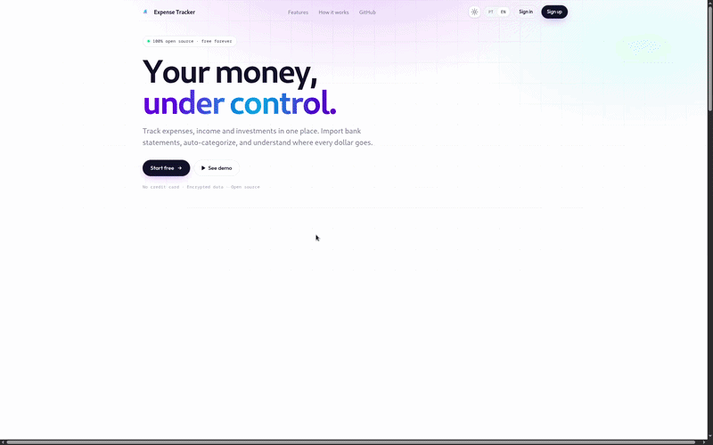

<p align="right">
  <a href="./README.md"></a>
  <a href="./README.pt-BR.md"></a>
</p>

<div align="center">
  
  <h1>💰 Expense Tracker</h1>
  <p><strong>Premium Personal Finance Management</strong></p>
  <p>A sophisticated, mobile-first financial companion built with React 19, Supabase, and Tailwind CSS 4.</p>

  <div align="center">
    
  </div>

  <br />

  
  
  
  
  
  
  [](https://sonarcloud.io/summary/new_code?id=davydfontourac_controle-de-gastos)

  <br />

  [🌐 Live Demo](https://controle-de-gastos-tan-six.vercel.app) · [🐞 Report Bug](https://github.com/davydfontourac/expense-tracker/issues) · [💡 Request Feature](https://github.com/davydfontourac/expense-tracker/issues)
</div>

---

## 🚀 Key Features (Develop Branch)

The latest version introduces powerful tools for advanced financial control:

- **📱 PWA & Mobile-First** — Optimized for mobile use with offline support and "Install to Home Screen" capability.
- **🕵️ Privacy Mode** — Hide sensitive financial data with a single click, perfect for public or shared environments.
- **🏦 Immersive Bank Import** — A three-step wizard for CSV imports with automatic category mapping and real-time preview.
- **🎯 Savings Goals** — Set, track, and achieve your financial milestones with visual progress indicators.
- **📊 Optimized Dashboard** — Real-time analytics powered by PostgreSQL RPCs, ensuring instant updates and accurate balance tracking.
- **🔐 Enhanced Security** — Robust authentication flow including password recovery and mobile-optimized login views.
- **🌓 Adaptive Theme** — Full support for Light and Dark modes with fluid Framer Motion transitions.

---

## 🛠️ Technology Stack

| Core | Styles & Motion | Logic & Data |
|---|---|---|
| **React 19** | **Tailwind CSS 4** | **Supabase** (DB & Auth) |
| **TypeScript** | **Framer Motion** | **Zod** (Validation) |
| **Vite 7** | **Lucide Icons** | **React Hook Form** |
| **Recharts** | **Sonner** (Toasts) | **Vitest** (Testing) |

---

## 💻 Getting Started

### Prerequisites

- **Node.js** 20 or higher
- **NPM** or **Yarn**
- A **Supabase** account

### Setup Instructions

1. **Clone & Install**
   ```bash
   git clone https://github.com/davydfontourac/expense-tracker.git
   cd expense-tracker
   npm install
   ```

2. **Environment Configuration**
   Create a `.env` file and add your Supabase credentials:
   ```env
   VITE_SUPABASE_URL=https://your-project.supabase.co
   VITE_SUPABASE_ANON_KEY=your-anon-key-here
   ```

3. **Database Migration**
   Apply the SQL scripts in `supabase/migrations` to your Supabase project to enable dashboard RPCs and savings features.

4. **Launch Development Server**
   ```bash
   npm run dev
   ```

---

## 🧪 Quality Assurance

We maintain high standards through automated testing and analysis:

```bash
# Execute unit tests
npm run test:run

# Open visual test dashboard
npm run test:ui

# Generate code coverage report
npm run test:coverage
```

---

## 📁 Project Architecture

```
expense-tracker/
├── src/
│   ├── components/     # High-performance UI components
│   ├── context/        # State management (Auth, Theme, Privacy)
│   ├── hooks/          # Domain logic & custom hooks
│   ├── pages/          # Full-page views
│   ├── services/       # Infrastructure (Supabase)
│   └── utils/          # Schemas and helper functions
├── supabase/
│   └── migrations/     # Database schema and logic
└── public/             # PWA assets & static files
```

---

<div align="center">
  Built with precision by <a href="https://github.com/davydfontourac">Davyd Fontoura</a>
  <br />
  Released under the <a href="./LICENSE">MIT License</a>
</div>
