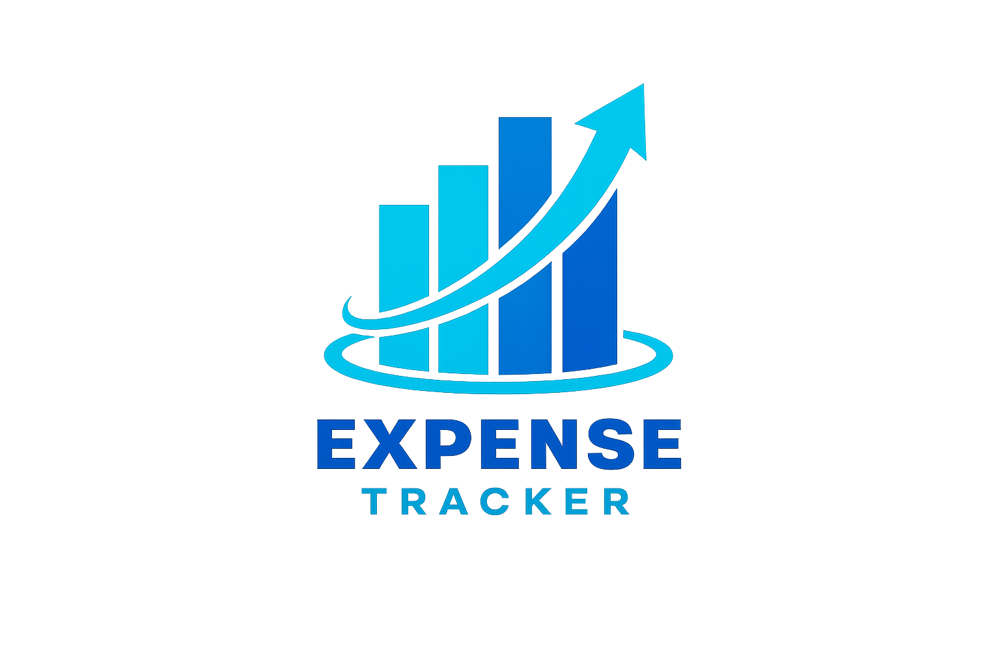

<p align="right">
  <a href="./README.md"></a>
  <a href="./README.pt-BR.md"></a>
</p>

<div align="center">
  
  <h1>💰 Expense Tracker</h1>
  <p>Personal finance management with a smart dashboard, charts, and customizable categories.</p>

  <div align="center">
    
  </div>

  
  
  
  
  
  
  [](https://sonarcloud.io/summary/new_code?id=davydfontourac_expense-tracker)

  [🌐 Live Demo](https://controle-de-gastos-tan-six.vercel.app) · [📋 Issues](https://github.com/davydfontourac/expense-tracker/issues)
</div>

---

## ✨ Features

- **🔐 Full Authentication** — Login, registration, password recovery, and OAuth via Supabase Auth
- **💳 Transactions** — Full CRUD with categories, type (income/expense), date, and search
- **📊 Dashboard** — Monthly summary with total balance, income, expenses, and yearly history
- **🗂️ Categories** — Built-in categories + creation of custom categories with color and emoji
- **👤 Profile** — Update username, avatar, and password
- **🌑 Dark Mode** — Toggle between light and dark themes
- **📱 Responsive** — Mobile-first layout with bottom navigation on small screens
- **🎭 Animations** — Page transitions and micro-animations with Framer Motion

---

## 🛠️ Tech Stack

### Frontend
| Technology | Usage |
|---|---|
| React 19 + TypeScript | UI and type safety |
| Vite | Build tool and dev server |
| Tailwind CSS 4 | Styling |
| Framer Motion | Animations and transitions |
| Recharts | Dashboard charts |
| React Hook Form + Zod | Forms with validation |
| React Router DOM | Routing |
| Sonner | Toast notifications |
| Supabase JS | Auth and database |

### Backend
| Technology | Usage |
|---|---|
| Node.js + Express 5 | REST API |
| TypeScript | Type safety |
| Supabase Admin | Privileged database access |
| Zod | Route payload validation |
| Helmet + CORS | Security |

### Infrastructure
| Service | Usage |
|---|---|
| Supabase | Auth + PostgreSQL |
| Vercel | Frontend deploy and hosting |
| Railway | Backend API deploy |
| GitHub Actions | CI/CD with tests and code analysis |
| SonarCloud | Static analysis and code coverage |
| Vitest + Supertest | Unit and integration tests |

---

## 🚀 Running Locally

### Prerequisites
- Node.js 20+
- A [Supabase](https://supabase.com) account

### 1. Clone the repository
```bash
git clone https://github.com/davydfontourac/expense-tracker.git
cd expense-tracker
```

### 2. Set up the Frontend
```bash
# Install dependencies
npm install

# Create the environment variables file
cp .env.example .env.local
```

Fill in `.env.local`:
```env
VITE_SUPABASE_URL=https://YOUR_PROJECT.supabase.co
VITE_SUPABASE_ANON_KEY=your_anon_key_here
VITE_API_URL=http://localhost:3000
```

```bash
# Start the frontend
npm run dev
```

### 3. Set up the Backend
```bash
cd server

# Install dependencies
npm install

# Create the environment variables file
cp .env.example .env
```

Fill in `server/.env`:
```env
SUPABASE_URL=https://YOUR_PROJECT.supabase.co
SUPABASE_SERVICE_ROLE_KEY=your_service_role_key_here
PORT=3000
NODE_ENV=development
```

```bash
# Start the backend
npm run dev
```

---

## 🧪 Tests

```bash
# Frontend — unit tests
npm run test:run

# Frontend — with visual UI
npm run test:ui

# Frontend — with coverage
npm run test:coverage

# Backend — integration tests
cd server && npm run test
```

---

## 📁 Project Structure

```
expense-tracker/
├── src/
│   ├── components/     # Reusable components
│   ├── context/        # AuthContext, ThemeContext
│   ├── hooks/          # useTransactions, useCategories
│   ├── pages/          # Dashboard, Login, Register, Profile...
│   ├── services/       # api.ts, supabase.ts
│   └── types/          # Global TypeScript types
├── server/
│   └── src/
│       ├── controllers/ # Route logic
│       ├── middlewares/ # authMiddleware
│       ├── routes/      # API endpoints
│       └── utils/       # Validators (Zod)
├── .github/workflows/  # CI/CD Pipeline
└── public/             # Static assets
```

---

## 🔁 CI/CD Flow

```
Push / PR → develop or main
     │
     ├── 🧪 Frontend Tests  (Vitest + Coverage)
     ├── 🧪 Backend Tests   (Vitest + Supertest)
     │           │
     │     (both pass)
     │
     ├── 📊 SonarCloud Analysis
     ├── 🏗️  Vite Build
     └── 🚀 Vercel Deploy
              │
       develop → preview
       main    → production
```

---

## 🛣️ Roadmap

- [ ] Savings goals per category
- [ ] PDF/CSV report export
- [ ] Recurring transactions
- [ ] Multiple wallets/accounts
- [ ] Spending limit notifications
- [ ] Mobile app (React Native)

---

<div align="center">
  Made with ❤️ by <a href="https://github.com/davydfontourac">Davyd Fontoura</a>
</div>
