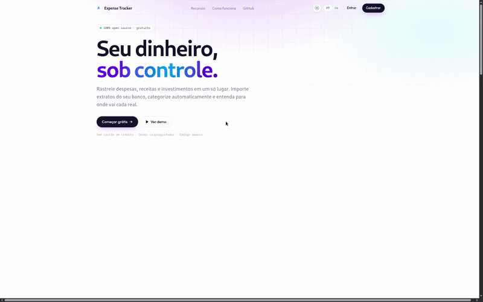

<p align="right">
  <a href="./README.md"></a>
  <a href="./README.pt-BR.md"></a>
</p>

<div align="center">
  
  <h1>💰 Expense Tracker</h1>
  <p><strong>Gestão de Finanças Pessoais de Alto Nível</strong></p>
  <p>Um companheiro financeiro sofisticado, focado em mobile, construído com React 19, Supabase e Tailwind CSS 4.</p>

  <div align="center">
    
  </div>

  <br />

  
  
  
  
  
  
  [](https://sonarcloud.io/summary/new_code?id=davydfontourac_controle-de-gastos)

  <br />

  [🌐 Ver Demo](https://controle-de-gastos-tan-six.vercel.app) · [🐞 Reportar Bug](https://github.com/davydfontourac/expense-tracker/issues) · [💡 Sugerir Funcionalidade](https://github.com/davydfontourac/expense-tracker/issues)
</div>

---

## 🚀 Principais Funcionalidades (Branch Develop)

A versão mais recente introduz ferramentas poderosas para um controle financeiro avançado:

- **📱 PWA & Mobile-First** — Otimizado para uso móvel com suporte offline e capacidade de instalação na tela inicial.
- **🕵️ Modo Privacidade** — Oculte dados financeiros sensíveis com um único clique, ideal para ambientes públicos.
- **🏦 Importação Bancária Imersiva** — Assistente de três etapas para importação de CSV com mapeamento automático de categorias e pré-visualização em tempo real.
- **🎯 Metas de Economia** — Defina, acompanhe e alcance seus marcos financeiros com indicadores visuais de progresso.
- **📊 Dashboard Otimizado** — Análises em tempo real alimentadas por RPCs no PostgreSQL, garantindo atualizações instantâneas e saldo sempre preciso.
- **🔐 Segurança Reforçada** — Fluxo de autenticação robusto, incluindo recuperação de senha e telas de login otimizadas para mobile.
- **🌓 Tema Adaptativo** — Suporte completo para modos Claro e Escuro com transições fluidas via Framer Motion.

---

## 🛠️ Stack Tecnológica

| Core | Estilo & Movimento | Lógica & Dados |
|---|---|---|
| **React 19** | **Tailwind CSS 4** | **Supabase** (DB & Auth) |
| **TypeScript** | **Framer Motion** | **Zod** (Validação) |
| **Vite 7** | **Lucide Icons** | **React Hook Form** |
| **Recharts** | **Sonner** (Toasts) | **Vitest** (Testes) |

---

## 💻 Primeiros Passos

### Pré-requisitos

- **Node.js** 20 ou superior
- **NPM** ou **Yarn**
- Uma conta no **Supabase**

### Instruções de Instalação

1. **Clonar & Instalar**
   ```bash
   git clone https://github.com/davydfontourac/expense-tracker.git
   cd expense-tracker
   npm install
   ```

2. **Configuração de Ambiente**
   Crie um arquivo `.env` e adicione suas credenciais do Supabase:
   ```env
   VITE_SUPABASE_URL=https://seu-projeto.supabase.co
   VITE_SUPABASE_ANON_KEY=sua-anon-key-aqui
   ```

3. **Migração do Banco de Dados**
   Aplique os scripts SQL em `supabase/migrations` ao seu projeto Supabase para habilitar as RPCs do dashboard e funcionalidades de metas.

4. **Iniciar Servidor de Desenvolvimento**
   ```bash
   npm run dev
   ```

---

## 🧪 Garantia de Qualidade

Mantemos altos padrões através de testes automatizados e análises:

```bash
# Executar testes unitários
npm run test:run

# Abrir interface visual de testes
npm run test:ui

# Gerar relatório de cobertura de código
npm run test:coverage
```

---

## 📁 Arquitetura do Projeto

```
expense-tracker/
├── src/
│   ├── components/     # Componentes de UI de alta performance
│   ├── context/        # Gestão de estado (Auth, Tema, Privacidade)
│   ├── hooks/          # Lógica de domínio & hooks personalizados
│   ├── pages/          # Visualizações de página completa
│   ├── services/       # Infraestrutura (Supabase)
│   └── utils/          # Schemas e funções auxiliares
├── supabase/
│   └── migrations/     # Schema e lógica do banco de dados
└── public/             # Assets PWA & arquivos estáticos
```

---

<div align="center">
  Construído com precisão por <a href="https://github.com/davydfontourac">Davyd Fontoura</a>
  <br />
  Distribuído sob a <a href="./LICENSE">Licença MIT</a>
</div>
